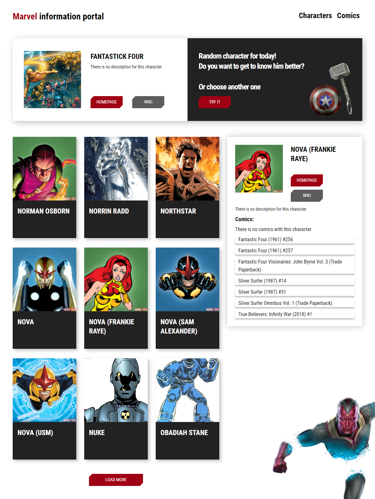
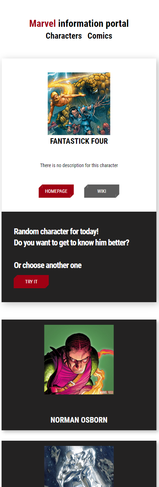

# [Marvel - База Данных Всех персоонажей и комиксов](https://alekseykalinin.ru/projects/ReactJS/marvel_db/index.html)

# [Marvel - База Данных Всех персоонажей и комиксов](https://alekseykalinin.ru/projects/ReactJS/marvel_db/index.html)

Разработан на React.

Добро пожаловать в проект Marvel Database - ваш исчерпывающий источник информации о персонажах и комиксах Marvel. Этот личный проект разработан для предоставления пользователям увлекательного опыта исследования вселенной Marvel. Вот что вы можете ожидать от этого проекта:

Основные функции:
Бесконечная прокрутка: Забудьте о пагинации! Marvel Database предлагает бесконечное прокручивание, позволяя вам легко исследовать обширную коллекцию персонажей и комиксов.

Поиск Персонажей: Ищете конкретного персонажа Marvel? Наша функция поиска позволяет быстро находить персонажей по имени, чтобы вы могли быстро получить доступ к их профилям и комиксам.

Генератор Случайных Персонажей: Чувствуете себя авантюристом? Используйте генератор случайных персонажей, чтобы открывать новых героев и злодеев из мира Marvel, с которыми вы раньше, возможно, не сталкивались.

Комплексные Списки Комиксов: Исследуйте все комиксы, в которых появлялись ваши любимые персонажи Marvel, охватывая десятилетия насыщенных рассказов. Получите представление о их богатой повествовательной истории.

Почему Marvel Database?
Marvel Database нацелена на то, чтобы стать основным ресурсом для поклонников Marvel и новичков. Будь вы давним поклонником, желающим освежить в памяти приключения своих любимых персонажей, или новичком, готовым погрузиться в мир Marvel, в этом проекте есть что-то для каждого.

Marvel Database - это яркий пример разработки с открытым исходным кодом и дань творческому гению, лежащему в основе комиксов Marvel. Этот проект постоянно развивается, и мы приглашаем к участию разработчиков и фанатов, разделяющих нашу страсть к вселенной Marvel.

Попробуйте Сами!
Посетите проект Marvel Database и отправляйтесь в путешествие по вселенной Marvel, как никогда раньше. Откройте для себя персонажей, переживайте знаковые моменты и окунитесь в захватывающий мир комиксов Marvel.

Присоединяйтесь к нам в праздновании необыкновенных персонажей и историй, которые захватили сердца миллионов людей по всему миру. Эксельсиор!

  ===========

# [Marvel - Database of All Characters and Comics](https://alekseykalinin.ru/projects/ReactJS/marvel_db/index.html)
  
Welcome to the Marvel Database project, your ultimate resource for exploring the vast world of Marvel characters and comics. This pet project is designed to provide users with an immersive experience as they delve into the Marvel Universe. Here's what you can expect from this project:

Key Features:
Endless Scrolling: Say goodbye to pagination! Marvel Database offers an infinite scrolling experience, allowing you to effortlessly explore an extensive collection of characters and comics.

Character Search: Looking for a specific Marvel character? Our search feature makes it easy to find characters by name, so you can quickly access their profiles and comic appearances.

Random Character Generator: Feeling adventurous? Use the random character generator to discover new Marvel heroes and villains you might not have encountered before.

Comprehensive Comic Listings: Explore all the comic appearances of your favorite Marvel characters, spanning across decades of storytelling. Get insights into their rich narrative history.

Why Marvel Database?
Marvel Database aims to be the go-to platform for Marvel enthusiasts and newcomers alike. Whether you're a long-time fan looking to brush up on your favorite character's adventures or a newcomer eager to explore the Marvel Universe, this project has something for everyone.

Marvel Database is a testament to the power of open-source development and a tribute to the creative genius behind the Marvel comics. It's an evolving project, and we welcome contributions from fellow developers and fans who share our passion for all things Marvel.

Try It Out!
Visit the Marvel Database project and embark on a journey through the Marvel Universe like never before. Discover characters, relive iconic moments, and get lost in the captivating world of Marvel comics.

Join us as we celebrate the extraordinary characters and stories that have captured the hearts of millions around the globe. Excelsior!
